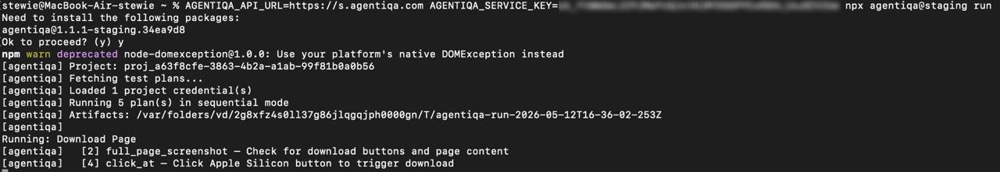

# Run from CI — quick-start

Run your saved Agentiqa test plans from a terminal in one command. The
Agentiqa app builds the command for you, mints a service key, and
encodes the right environment so the CLI auto-installs and starts
immediately.

Works the same way from the desktop app and `web.agentiqa.com`.

## TL;DR

1. Open a project → **Test Plans**.
2. Click the **CLI** button (top right of the list).

   

3. (Optional) Filter plans by label and flip the **Parallel** toggle
   first — the modal will mirror both.
4. Copy the command from the modal.

   

5. Paste into a terminal → Enter. The CLI installs, authenticates with
   the minted key, downloads the plans, and runs them in a local
   Playwright browser.

   

## What the command looks like

```
AGENTIQA_SERVICE_KEY=sk_<key> npx agentiqa@latest run [--label-ids id1,id2,...] [--mode parallel]
```

- `--label-ids` is included only when a label filter is active on the
  page. See the selector warning below.
- `--mode parallel` is included only when the Parallel toggle is on.

### Selecting which plans run (service-key mode)

- `--label-ids id1,id2,...` — run every plan tagged with any of
  those labels.
- `--plan-id <id>` — run a single saved plan by its ID.
- ⚠️ **With a service key and no selector (`--label-ids` /
  `--plan-id`), `run` executes _every_ plan in the project.** The
  **CLI** button omits the selector only when no label filter is
  active — add one yourself if you don't intend to run all of them.

### Other options

- `--engine <url>` — drive a hosted engine instead of the local
  in-process one. When set, Playwright/Chromium and ffmpeg are **not**
  installed locally; the remote engine runs the browser.
- `--mode sequential|parallel` — execution order (default:
  `sequential`).

## Running a local plan file instead

For a plan authored in-repo (e.g. by a coding agent) rather than saved
in the app, skip the service key and point `run` at a JSON file. This
mode requires `--url` and authenticates with `agentiqa login` (an
interactive session) instead of `AGENTIQA_SERVICE_KEY`:

```
agentiqa run --url https://staging.example.com --plan ./plan.json
```

The plan file is a JSON object with `id`, `projectId`, `title`,
`createdAt`, `updatedAt`, and a `steps` array of `setup` / `action` /
`verify` steps. See the `agentiqa-test` skill for a minimal valid
example.

## What gets executed

1. CLI reads `AGENTIQA_SERVICE_KEY` and authenticates against the API
   base.
2. Fetches plans matching the label filter for the key's project.
3. Boots a local embedded engine and runs each plan with its saved
   config (model, headless, viewport).
4. Streams per-step status to stdout; saves screenshots to a temp
   directory printed on exit.

## Re-using a key

Each project remembers its minted key (idempotent endpoint). Re-opening
the modal on the same project reuses the existing key. Rotate via
**Settings → Service Keys**.
