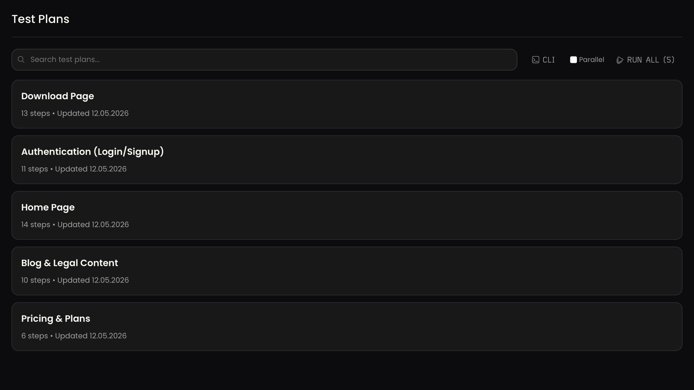
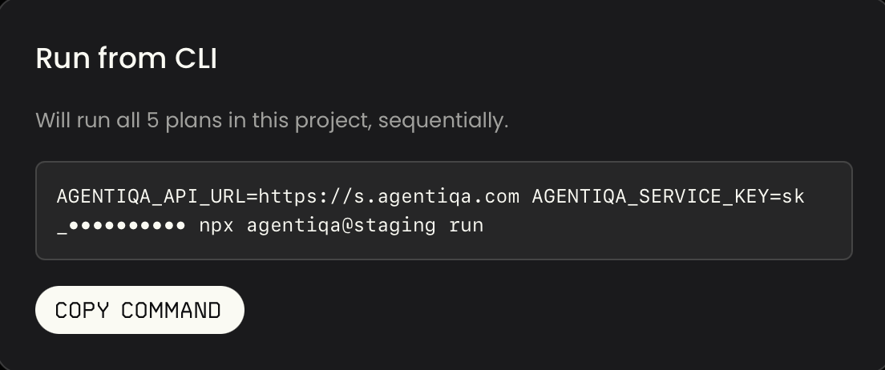

# Run from CLI — quick-start

Run your saved Agentiqa test plans from a terminal in one command. The
Agentiqa app builds the command for you, mints a service key, and
encodes the right environment so the CLI auto-installs and starts
immediately.

Works the same way from the desktop app and `web.agentiqa.com`.

## TL;DR

1. Open a project → **Test Plans**.
2. Click the **CLI** button (top right of the list).

   

3. (Optional) Filter plans by label and flip the **Parallel** toggle
   first — the modal will mirror both.
4. Copy the command from the modal.

   

5. Paste into a terminal → Enter. The CLI installs, authenticates with
   the minted key, downloads the plans, and runs them in a local
   Playwright browser.

   

## What the command looks like

```
AGENTIQA_SERVICE_KEY=sk_<key> npx agentiqa@latest run [--label-ids id1,id2,...] [--mode parallel]
```

- `--label-ids` is included only when a label filter is active on the
  page. With no filter, the command runs **all** plans in the project.
- `--mode parallel` is included only when the Parallel toggle is on.

## What gets executed

1. CLI reads `AGENTIQA_SERVICE_KEY` and authenticates against the API
   base.
2. Fetches plans matching the label filter for the key's project.
3. Boots a local embedded engine and runs each plan with its saved
   config (model, headless, viewport).
4. Streams per-step status to stdout; saves screenshots to a temp
   directory printed on exit.

## Redacted on screen, real in clipboard

The modal shows `sk_••••••••••` so the key is safe during pair sessions
and screen-shares — the **real** key goes to the clipboard on Copy.

## Re-using a key

Each project remembers its minted key (idempotent endpoint). Re-opening
the modal on the same project reuses the existing key. Rotate via
**Settings → Service Keys**.

## Troubleshooting

- **`401`** — service key revoked. Re-open the modal to mint fresh.
- **`No test plans matched`** — wrong label filter or wrong project.
- **`npx agentiqa: not found` / hangs** — `npm cache clean --force`.
- **`Engine is restarting`** — port conflict with another local agent;
  kill it and retry.
